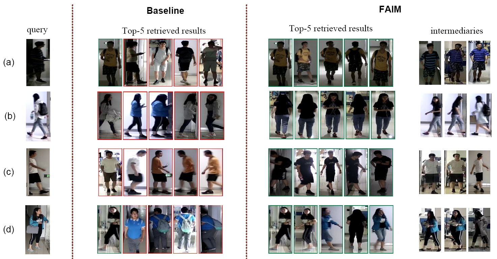

# FAIM: Clothes-Changing Person Re-Identification with Feasibility-Aware Intermediary Matching
FAIM is a clothes-changing person re-id method that leverages intermediaries to improve the identity matching results in clothes-changing scenarios.
For more details, please refer to the [paper](https://arxiv.org/abs/2404.09507).

## Introduction
We propose an intermediary matching method, using extra intermediaries to improve the clothes-changing matching results when clothes-irrelevant features are of low quality.

## Dataset Preparation
We mainly use three clothes-changing re-id benchmarks for training and evaluation: LTCC, PRCC and DeepChange.

## Environment Setup
- Python 3.8, PyTorch 1.12
- Install the dependencies:
```sh
pip install -r requirements.txt
```
- To run GNN re-ranking method, you need to manually install the [gnn reranking tools](https://github.com/layumi/Person_reID_baseline_pytorch/tree/master/GPU-Re-Ranking#prerequisites)

## Training
Take LTCC dataset as an example
- Setup the configuration files at `configs/res50_cels_cal_reliability_ltcc.yaml`. Replace `DATA.ROOT` to your own root directory containing LTCC dataset. Replace `OUTPUT` to your own output directory.
- Run the corresponding lines in `scripts.sh`

## Testing
Take the testing of LTCC dataset as an example
- Setup the test configurations at `configs/res50_cels_cal_reliability_test.yaml`.
  1. Replace `DATA.ROOT` to your own root directory containing LTCC dataset. Replace `OUTPUT` to your own output directory.
  2. For FAIM implemented with K-reciprocal neighboring, set `TEST.RERANKING=1`. For FAIM implemented with GNN, set `TEST.RERANKING=2`.
- Run the corresponding lines in `test_scripts.sh`. Change the `--resume` to your own checkpoint path.

## Some Visualizations
<div>
  
</div>

## Citations
If you find our paper and codebase helpful, please consider citing
```
@misc{zhao2024clotheschanging,
      title={Clothes-Changing Person Re-Identification with Feasibility-Aware Intermediary Matching}, 
      author={Jiahe Zhao and Ruibing Hou and Hong Chang and Xinqian Gu and Bingpeng Ma and Shiguang Shan and Xilin Chen},
      year={2024},
      eprint={2404.09507},
      archivePrefix={arXiv},
      primaryClass={id='cs.CV' full_name='Computer Vision and Pattern Recognition' is_active=True alt_name=None in_archive='cs' is_general=False description='Covers image processing, computer vision, pattern recognition, and scene understanding. Roughly includes material in ACM Subject Classes I.2.10, I.4, and I.5.'}
}
```

### Acknowledgements
This code implementation is based on [Simple-CCReID](https://github.com/guxinqian/Simple-CCReID).
